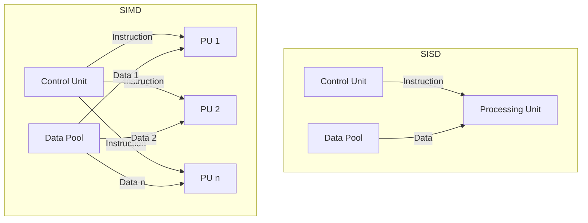

# 📌 Tassonomia di Flynn e Architetture Parallele

## 1. Contesto e Motivazione
Per comprendere appieno il ruolo di un Sistema Operativo, è imperativo analizzare prima l'hardware sottostante su cui esso opera. La classificazione delle architetture di calcolo permette di delineare le strategie di parallelismo e di esecuzione delle istruzioni. 

> **Definizione:** La *Tassonomia di Flynn* (1966) è il framework teorico standard per categorizzare i sistemi di elaborazione in base alla molteplicità dei flussi di istruzioni (Instruction Stream) e dei flussi di dati (Data Stream).

## 2. Nucleo Teorico ed Elaborazione Tecnica

La Tassonomia di Flynn si articola in quattro paradigmi architetturali fondamentali:

1. **SISD (Single Instruction, Single Data):** Rappresenta la classica architettura di von Neumann monoprocessore. Un singolo flusso di istruzioni opera sequenzialmente su un singolo flusso di dati.
   - **Esempio:** Vecchi PC a singolo core (es. Intel Pentium 4) o semplici microcontrollori usati in sistemi embedded base.

2. **SIMD (Single Instruction, Multiple Data):** Un'unica unità di controllo dispaccia la medesima istruzione a più unità di elaborazione (ALU), ciascuna operante su un set di dati distinto. Questa architettura è ottimizzata per il data-level parallelism (calcolo vettoriale).
   - **Esempio:** GPU moderne (Nvidia, AMD) per il rendering grafico o il training di reti neurali, ed estensioni vettoriali nelle CPU (istruzioni SSE/AVX).

3. **MISD (Multiple Instruction, Single Data):** Architettura inusuale e prevalentemente teorica, in cui molteplici flussi di istruzioni operano sul medesimo flusso di dati.
   - **Esempio:** Sistemi fault-tolerant impiegati in campo aerospaziale (es. computer dello Space Shuttle) dove diverse CPU eseguono algoritmi diversi sugli stessi dati dei sensori per verificare la consistenza o applicare filtri digitali multipli.

4. **MIMD (Multiple Instruction, Multiple Data):** Costituisce il modello dominante per il calcolo parallelo e distribuito. Molteplici processori indipendenti eseguono flussi di istruzioni eterogenei su flussi di dati distinti.
   - I sistemi MIMD si suddividono ulteriormente in base all'accoppiamento:
     - *Multiprocessori (Shared Memory / Strettamente Accoppiati):* Condividono lo stesso spazio di indirizzamento fisico e un unico clock. La comunicazione avviene a bassa latenza tramite il bus di sistema.
     - *Multicalcolatori (Distributed Memory / Lascamente Accoppiati):* Nodi indipendenti con memoria locale (es. Cluster, Grid, Cloud). La comunicazione avviene tramite scambio di messaggi su reti di interconnessione (con topologie a stella, anello, griglia, toro, ipercubo).
   - **Esempio:** Server multiprocessore moderni, cluster di supercalcolo, processori Intel/AMD multi-core.

> **Consiglio:** Le moderne CPU multicore implementano in realtà un paradigma ibrido: operano nativamente come sistemi MIMD a memoria condivisa, ma incorporano unità vettoriali che operano in logica SIMD all'interno del singolo core.

### 2.1 Diagramma Architetturale

Di seguito la schematizzazione dei flussi logici secondo Flynn:

## 3. Modello Matematico / Formalizzazione

La metrica fondamentale per valutare il parallelismo in architetture MIMD/SIMD è lo *Speedup* ($S$), definito dalla **Legge di Amdahl**.

> **Definizione:** La Legge di Amdahl afferma che il miglioramento delle prestazioni (Speedup) di un sistema, ottenuto parallelizzando una parte del carico di lavoro, è strettamente limitato dalla frazione di lavoro che deve rimanere puramente sequenziale.

Se $P$ è la frazione parallelizzabile del carico di lavoro e $N$ è il numero di processori, lo speedup teorico massimo rispetto a un processore singolo è dato da:

$$S(N) = \frac{1}{(1 - P) + \frac{P}{N}}$$

Al tendere di $N \to \infty$, lo speedup è asintoticamente limitato dalla porzione strettamente sequenziale dell'algoritmo, divenendo $S_{max} = \frac{1}{1-P}$.

### 3.1 Esercizio Pratico
**Problema:** Supponiamo che un programma richieda 100 secondi per essere eseguito su una singola CPU. Analizzando il codice, si scopre che l'80% del tempo di esecuzione può essere parallelizzato, mentre il restante 20% è intrinsecamente sequenziale. Qual è lo Speedup massimo teorico se si utilizzano 4 core? E con infiniti core?

**Procedimento:**
1. Identifichiamo i parametri: $P = 0.8$ (frazione parallelizzabile), $1 - P = 0.2$ (frazione sequenziale).
2. Per calcolare lo speedup con $N = 4$, applichiamo la formula:
   $$S(4) = \frac{1}{0.2 + \frac{0.8}{4}} = \frac{1}{0.2 + 0.2} = \frac{1}{0.4} = 2.5$$
3. (Opzionale) Il nuovo tempo di esecuzione totale con 4 core sarà $100 / 2.5 = 40$ secondi.
4. Con infiniti core ($N \to \infty$), il termine $\frac{P}{N}$ tende a zero, quindi lo speedup asintotico è:
   $$S(\infty) = \frac{1}{0.2} = 5$$

**Conclusione:** Nonostante si aggiungano infiniti processori, il programma subirà al massimo uno speedup di 5x e non potrà mai essere eseguito in meno di 20 secondi (il limite imposto dal codice sequenziale).

## 4. Riferimenti Incrociati (Zettelkasten)
- **Nota Upstream (Concetto più generale):** [[Sistema di Elaborazione]]
- **Note Downstream (Specifiche/Esempi):** [[Architetture Multicore]], [[Topologie di Rete nei Sistemi Distribuiti]]
- **Note Correlate (Orizzontali):** [[202607011231_Fondamenti_Sistemi_Operativi]]
