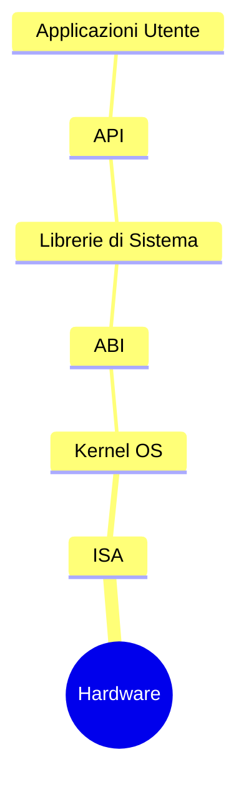

# 📌 Fondamenti e Astrazioni dei Sistemi Operativi

## 1. Contesto e Motivazione
L'hardware nudo di un calcolatore è intrinsecamente complesso, ostico da programmare e non intrinsecamente sicuro. Il Sistema Operativo (SO) emerge come strato software critico, agendo da intermediario e gestore. 

> **Definizione:** Il *Sistema Operativo* è il software sistemistico che funge da intermediario tra l'utente e l'hardware. Il suo scopo duale è fornire un'interfaccia astratta ad alto livello (Application Programming Interface, API) per i programmatori, celando i dettagli fisici (Bottom-Up), e fungere da allocatore rigoroso delle risorse hardware (CPU, Memoria, I/O) in ottica di multiplexing nel tempo e nello spazio (Top-Down).

## 2. Nucleo Teorico ed Elaborazione Tecnica
Un Sistema Operativo è il software sistemistico sempre in esecuzione (il **Kernel**), affiancato da librerie e utility di sistema. Le sue macro-funzioni sono:
- **Gestione dei Processi:** Creazione, scheduling, sospensione e meccanismi IPC (Inter-Process Communication).
- **Gestione della Memoria (Centrale e Secondaria):** Tracciamento delle allocazioni, memoria virtuale, paging, buffering e gestione del file system.
- **Gestione I/O:** Mascheramento della latenza hardware tramite driver, buffer caching e interrupt handling.
- **Sicurezza e Protezione:** Separazione dei privilegi (User Mode vs Kernel Mode) e controllo accessi.

### I Livelli di Astrazione
Per disaccoppiare l'hardware dal software, i sistemi informatici implementano tre livelli di interfacciamento critici:
1. **ISA (Instruction Set Architecture):** L'interfaccia a livello macchina che definisce il set di istruzioni comprensibili dall'hardware.
   - *Esempio:* x86_64 (Intel/AMD), ARMv8 (Apple Silicon, Smartphone).
2. **ABI (Application Binary Interface):** L'interfaccia a livello di sistema operativo. Definisce le convenzioni di chiamata, il layout della memoria e l'interazione dei binari compilati con le chiamate di sistema (System Calls) del SO sottostante. Binari compilati per una data ABI possono girare su sistemi compatibili senza ricompilazione.
   - *Esempio:* ELF su Linux (System V ABI), PE/COFF su Windows.
3. **API (Application Programming Interface):** L'interfaccia ad alto livello (livello di libreria) offerta ai sorgenti software. Permette la portabilità del codice sorgente su SO eterogenei, a patto di ricompilare il codice.
   - *Esempio:* POSIX (Portable Operating System Interface) su sistemi UNIX-like, Win32 API su Windows.

> **Consiglio:** Il Kernel opera in un dominio di esecuzione privilegiato, noto come *Ring 0* nell'architettura x86, per prevenire istruzioni non autorizzate. Lo switch di contesto tra spazio utente e spazio kernel (causato da interrupt o trap/syscall) comporta un *overhead* prestazionale.

### 2.1 Modello ad Astrazione (Onion Model)

Il sistema può essere schematizzato a strati concentrici (modello a cipolla):

## 3. Modello Matematico / Formalizzazione
Non si applica una formalizzazione matematica pura, ma la commutazione di contesto (Context Switch) può essere modellata in termini di latenza temporale. Il tempo totale per l'esecuzione di un programma $T_{exec}$ è:

$$T_{exec} = T_{user} + T_{kernel} + N_{switch} \cdot T_{overhead}$$

Dove $T_{overhead}$ rappresenta il tempo speso dalla CPU unicamente per salvare e ripristinare il Program Counter (PC) e i registri durante le transizioni User-Kernel.

### 3.1 Esercizio Pratico
**Problema:** Un processo esegue per 50 ms in User Mode e richiede 20 ms di CPU in Kernel Mode (per soddisfare I/O). Durante la sua esecuzione, compie 1000 chiamate di sistema. Sapendo che ogni context switch (User -> Kernel e ritorno) ha un overhead di 5 $\mu s$, calcola il tempo totale di esecuzione $T_{exec}$ e la percentuale di tempo sprecato in overhead.

**Procedimento:**
1. Convertiamo tutto in millisecondi: $T_{user} = 50 \, \text{ms}$, $T_{kernel} = 20 \, \text{ms}$, $T_{overhead} = 5 \, \mu\text{s} = 0.005 \, \text{ms}$.
2. Calcoliamo l'overhead totale derivante dalle chiamate di sistema ($N_{switch} = 1000$):
   $$\text{Overhead Totale} = 1000 \times 0.005 \, \text{ms} = 5 \, \text{ms}$$
3. Calcoliamo $T_{exec}$:
   $$T_{exec} = 50 + 20 + 5 = 75 \, \text{ms}$$
4. La percentuale di tempo persa nel context switch è il rapporto tra overhead e tempo totale:
   $$\text{Spreco \%} = \frac{5}{75} \approx 6.67\%$$

## 4. Riferimenti Incrociati (Zettelkasten)
- **Nota Upstream (Concetto più generale):** [[Computer Science]]
- **Note Downstream (Specifiche/Esempi):** [[Gestione Memoria Virtuale]], [[System Calls e Gestione Interrupt]]
- **Note Correlate (Orizzontali):** [[202607011230_Tassonomia_Architetture_Flynn]], [[202607011232_Modelli_Architetturali_OS]]
