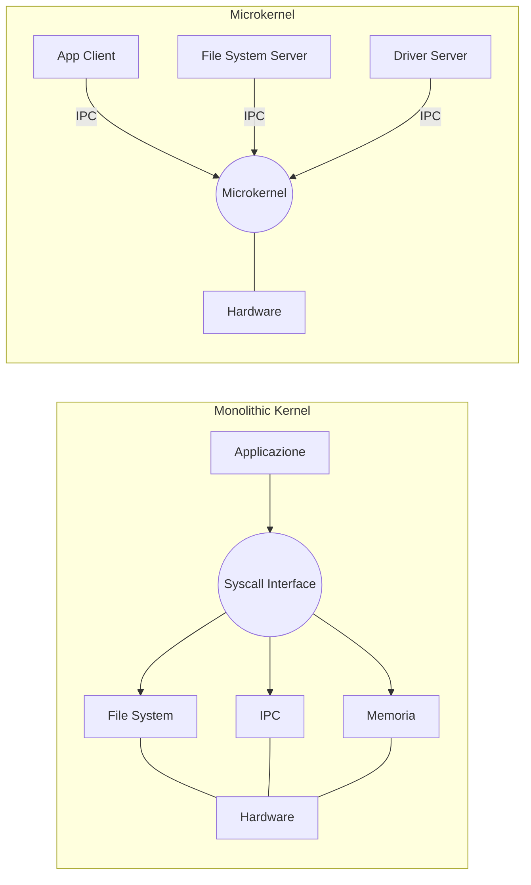

# 📌 Modelli Architetturali dei Sistemi Operativi

## 1. Contesto e Motivazione
La progettazione di un kernel determina profondamente le performance, l'estensibilità, l'affidabilità e la sicurezza del Sistema Operativo. Esistono paradigmi radicalmente opposti per la strutturazione del codice del SO, frutto di evoluzioni storiche e trade-off ingegneristici tra modularità e overhead di comunicazione.

> **Definizione:** L'*Architettura del Sistema Operativo* è l'organizzazione strutturale dei moduli software che compongono il Kernel e le modalità con cui essi interagiscono tra loro e con i processi utente.

## 2. Nucleo Teorico ed Elaborazione Tecnica
L'architettura del SO definisce come le sue componenti comunicano e con quali privilegi vengono eseguite:

1. **Architettura Monolitica:** L'intero SO (gestore memoria, file system, driver) è compilato in un unico file binario massivo che gira interamente in *Kernel Mode*.
   - *Pro:* Prestazioni massime. La comunicazione tra moduli avviene tramite invocazione di funzioni ad alta velocità nello stesso spazio di indirizzamento.
   - *Contro:* Scarsa affidabilità (un bug in un driver può causare il kernel panic), difficile manutenibilità.
   - **Esempio:** MS-DOS originale, UNIX classico.

2. **Architettura Stratificata (Layered):** Il SO è suddiviso in rigidi livelli (layer 0 a N), dove il livello $L_i$ espone servizi a $L_{i+1}$ e consuma servizi solo da $L_{i-1}$. 
   - *Pro:* Debugging sistematico, modularità formale.
   - *Contro:* Overhead prestazionale elevato per attraversare molteplici livelli; difficoltà nel definire i boundary dei layer.

3. **Architettura a Microkernel (Client/Server):** Sposta la massima quantità possibile di servizi (file system, device driver, network stack) nello Spazio Utente (*User Mode*), riducendo il kernel alle funzioni minime ed essenziali (gestione interrupt, scheduling di base, IPC). I servizi comunicano passandosi messaggi (Message Passing) tramite il microkernel.
   - *Pro:* Sicurezza e stabilità estreme (il crash di un driver non abbatte il kernel), facilità di estensione e porting. Adattabilità ai sistemi distribuiti.
   - *Contro:* Overhead critico dovuto ai continui context-switch e IPC per operazioni banali.
   - **Esempio:** MINIX 3, QNX (usato in ambito automotive), GNU Hurd.

4. **Architettura Ibrida:** Un compromesso pragmatico. Un nucleo monolitico per le prestazioni (dove file system e moduli core girano in kernel mode), ma che supporta il caricamento dinamico di moduli (Loadable Kernel Modules) e incorpora concetti client/server in specifici subsistemi (es. l'interfaccia grafica o servizi demoni).
   - **Esempio:** Linux (monolitico ma modulare), Windows NT, macOS XNU.

> **Consiglio:** La disputa Tanenbaum-Torvalds (1992) evidenziò la dicotomia tra il purismo teorico dei microkernel (MINIX) e il pragmatismo prestazionale dei monoliti ibridi (Linux). Oggi, le differenze nette si sono sfumate e OS moderni adottano design ibridi per fondere stabilità e performance.

### 2.1 Diagramma Architetturale
Ecco un confronto visivo tra un sistema Monolitico e un Microkernel:

## 3. Modello Matematico / Formalizzazione
In un microkernel, il costo temporale $C_{IPC}$ per la risoluzione di una richiesta di I/O è espresso dal numero di boundary User/Kernel attraversati.

**Modello Monolitico:** 
$C_{mono} = 2 \cdot C_{switch}$ (una syscall per entrare, un ritorno per uscire).

**Modello Microkernel:** 
$C_{micro} = 4 \cdot C_{switch} + C_{msg}$ 

### 3.1 Procedimento IPC nel Microkernel
1. L'App in User Space invia una richiesta al Microkernel ($1^\circ$ Context Switch).
2. Il Microkernel inoltra il messaggio al processo Server (es. FS Server) in User Space ($2^\circ$ Context Switch).
3. Il Server esegue il lavoro e risponde al Microkernel ($3^\circ$ Context Switch).
4. Il Microkernel restituisce il risultato all'App ($4^\circ$ Context Switch).

Si deduce che $\Delta C = C_{micro} - C_{mono} > 0$, evidenziando il trade-off teorico di latenza in favore dell'affidabilità per il Microkernel.

## 4. Riferimenti Incrociati (Zettelkasten)
- **Nota Upstream (Concetto più generale):** [[202607011231_Fondamenti_Sistemi_Operativi]]
- **Note Downstream (Specifiche/Esempi):** [[Kernel Linux vs MINIX]], [[Meccanismi di IPC]]
- **Note Correlate (Orizzontali):** [[202607011233_Virtualizzazione_Emulazione_OS]]
