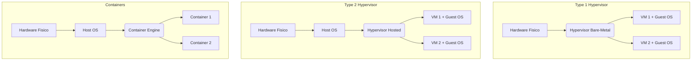

# 📌 Virtualizzazione ed Emulazione

## 1. Contesto e Motivazione
Con la convergenza del Cloud Computing e il consolidamento dei server, la massimizzazione dell'uso dell'hardware e l'interoperabilità tra sistemi eterogenei sono divenute priorità. La Virtualizzazione e l'Emulazione risolvono il problema permettendo l'esecuzione sicura di molteplici ambienti (Sistemi Operativi o Applicativi guest) sopra un'unica macchina fisica (Host), astratta mediante strati software intermedi.

> **Definizione:** La *Virtualizzazione* è la creazione di una versione virtuale di una risorsa hardware (server, storage, rete), mentre l'*Emulazione* è la riproduzione software del comportamento di un'architettura hardware diversa da quella ospitante.

## 2. Nucleo Teorico ed Elaborazione Tecnica

### Virtualizzazione
Consente di replicare fedelmente (astrarre) l'hardware fisico sottostante, garantendo che le macchine virtuali (VM) abbiano l'illusione di possedere l'hardware in via esclusiva. Il componente centrale è l'**Hypervisor (Virtual Machine Monitor, VMM)**. Il requisito chiave della virtualizzazione nativa è che Guest e Host condividano la medesima architettura ISA.

- **Hypervisor Type 1 (Bare-Metal):** Il VMM gira direttamente sull'hardware nudo, sostituendo l'OS Host. Offre latenza minima e performance enterprise.
  - **Esempio:** VMware ESXi, Xen, Microsoft Hyper-V.
- **Hypervisor Type 2 (Hosted):** Il VMM gira come un programma applicativo sopra un OS Host esistente.
  - **Esempio:** Oracle VirtualBox, VMware Workstation.
- **Virtualizzazione a livello di OS (Container):** Condivide l'istanza del kernel dell'Host tra ambienti isolati (Container). Le applicazioni "vedono" le proprie librerie ma condividono il kernel. L'overhead è azzerato e la densità di esecuzione è massima.
  - **Esempio:** Docker, LXC, Podman.

### Emulazione
Riproduce il comportamento di un'architettura (ISA) diversa da quella nativa.
- **Emulatore Stretto:** Software che traduce in real-time il set di istruzioni della macchina emulata in istruzioni dell'hardware reale. Soffre di un pesantissimo overhead prestazionale causato dalla decodifica continua delle istruzioni.
  - **Esempio:** QEMU (per far girare ARM su x86), emulatori di vecchie console (es. ePSXe per PlayStation).
- **Compatibility Layer (Emulazione ABI):** Non emula l'hardware, ma intercetta e traduce le chiamate di sistema (Syscall) e l'ABI del guest nelle chiamate equivalenti per il kernel Host. Poiché le istruzioni CPU girano nativamente, le performance sono quasi native.
  - **Esempio:** *Wine* per eseguire app Windows su Linux, o *WSL1* per eseguire Linux su kernel Windows NT.

> **Consiglio:** La virtualizzazione moderna è fortemente assistita dall'hardware (Intel VT-x, AMD-V) per abbattere l'overhead del VMM intercettando le istruzioni privilegiate a livello microarchitetturale, rendendo obsoleta la "full virtualization" basata sulla traduzione binaria dinamica.

### 2.1 Diagramma Architetturale

## 3. Modello Matematico / Formalizzazione
Il Teorema di Popek e Goldberg (1974) formalizza i requisiti per un VMM perfetto. Un'architettura è virtualizzabile se e solo se l'insieme delle sue *istruzioni sensibili* (che tentano di alterare lo stato o le risorse di sistema) è un sottoinsieme delle sue *istruzioni privilegiate* (che intrappolano in Kernel Mode se eseguite in User Mode). In notazione insiemistica:

$$I_{sensitive} \subseteq I_{privileged}$$

Questo assicura che il VMM possa sempre intercettare le operazioni critiche del Guest (Trap-and-Emulate). Storicamente, l'architettura x86 non rispettava questo teorema, forzando la virtualizzazione assistita dall'hardware.

### 3.1 Procedimento di Trap-and-Emulate
1. Il Guest OS (che gira in ring non privilegiato, es. Ring 1) tenta di eseguire un'istruzione I/O sensibile.
2. Poiché non ha i privilegi, la CPU genera una TRAP hardware.
3. Il VMM (che gira in Ring 0) intercetta la TRAP.
4. Il VMM ispeziona l'istruzione, aggiorna le strutture dati virtuali (come se l'I/O fosse avvenuto per quel Guest) ed emula l'effetto.
5. Il VMM restituisce il controllo al Guest OS all'istruzione successiva.

### 3.2 Esercizio Pratico
**Problema:** Un'architettura CPU possiede 100 istruzioni totali. Di queste, 15 interagiscono con l'I/O e i registri di controllo (istruzioni sensibili). L'hardware solleva un'eccezione (Trap) su 10 di queste 15 istruzioni se eseguite in User Mode, mentre le altre 5 vengono ignorate silenziosamente o eseguite senza errori apparenti ma alterando globalmente il sistema. Secondo Popek e Goldberg, questa architettura è virtualizzabile nativamente?

**Procedimento:**
1. Identificare $I_{sensitive}$: in questo caso, la cardinalità è 15.
2. Identificare quali di queste generano una Trap se eseguite senza privilegi ($I_{privileged}$). Nel testo, solo 10 su 15 generano Trap.
3. Verificare la condizione: $I_{sensitive} \subseteq I_{privileged}$.
4. Dato che ci sono 5 istruzioni sensibili che NON sono privilegiate (non generano Trap), l'insieme delle istruzioni sensibili non è interamente contenuto in quello delle istruzioni privilegiate.

**Conclusione:** L'architettura **non** è virtualizzabile nativamente (richiede tecniche complesse come la Binary Translation usata dalle prime versioni di VMware su x86).

## 4. Riferimenti Incrociati (Zettelkasten)
- **Nota Upstream (Concetto più generale):** [[Astrazione Hardware]]
- **Note Downstream (Specifiche/Esempi):** [[Docker e Containerizzazione]], [[Hypervisor Type 1 vs Type 2]]
- **Note Correlate (Orizzontali):** [[202607011232_Modelli_Architetturali_OS]]
