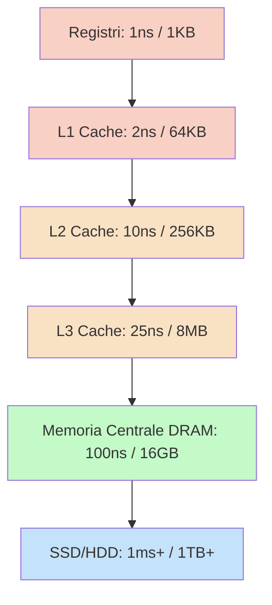

# 📌 Gerarchia della Memoria e Caching

## 1. Contesto e Motivazione
Il "Memory Wall" è uno dei problemi architetturali più severi: le CPU elaborano i dati a velocità di ordini di grandezza superiori rispetto alla velocità con cui la memoria centrale (RAM) riesce a fornirli. Per colmare questo divario senza incorrere in costi proibitivi, l'architettura dei calcolatori organizza la memoria gerarchicamente, sfruttando il principio di località (spaziale e temporale) per mantenere i dati usati di frequente nei supporti più veloci e costosi.

> **Definizione:** Il *Caching* è la tecnica di copiare temporaneamente dati da un supporto lento a uno più veloce per accelerarne i futuri accessi. Sfrutta il **Principio di Località Temporale** (se un dato è stato usato, verrà riusato a breve) e **Spaziale** (se un dato è stato usato, i dati vicini in memoria verranno usati a breve).

## 2. Nucleo Teorico ed Elaborazione Tecnica
La gerarchia si struttura bilanciando Velocità, Costo per bit e Volatilità. I livelli inferiori fungono da "cache" per i livelli immediatamente superiori. Il Sistema Operativo interviene attivamente nella gestione del caching tra memoria centrale e memoria secondaria (tramite Virtual Memory e Page Replacement), mentre il caching hardware (L1/L2/L3) è gestito trasparentemente dai controller della CPU.

| Livello | Tipologia Memoria | Tecnologia Base | Dimensione Tipica | Tempo di Accesso (ns) | Bandwidth | Gestore |
|---|---|---|---|---|---|---|
| **1** | Registri CPU | Custom CMOS | < 1 KB | $0.25 - 0.5$ | > 20 GB/s | Compilatore |
| **2** | Cache (L1, L2, L3) | SRAM (Static RAM) | < 16 MB | $0.5 - 25$ | $5 - 10$ GB/s | Hardware (CPU) |
| **3** | Memoria Centrale (RAM) | DRAM (Dynamic RAM)| < 64 GB | $80 - 250$ | $1 - 5$ GB/s | Sistema Operativo |
| **4** | Solid-State Disk (SSD) | Flash Memory NAND | < 1 TB | $25.000 - 50.000$ | ~ 500 MB/s | Sistema Operativo |
| **5** | Disco Magnetico (HDD) | Piatti Magnetici | < 10 TB | $5.000.000$ | $20 - 150$ MB/s | Sistema Operativo |

### 2.1 Caching e Consistenza
Il *caching* comporta la duplicazione dei dati. Poiché una copia risiede in cache e la versione originale in memoria centrale, sorge il problema della **Consistenza**. Se un dato viene modificato in cache, occorre una politica di aggiornamento:
- **Write-Through:** Ogni scrittura in cache viene propagata istantaneamente anche in memoria centrale. (Lento, ma sempre coerente).
- **Write-Back:** La scrittura avviene solo in cache. Il blocco viene contrassegnato come *Dirty* e sarà copiato in RAM solo quando verrà rimpiazzato (Sfrattato/Evicted). (Veloce, ma solleva problemi di coerenza in multiprocessore).

### 2.2 Diagramma della Gerarchia

## 3. Modello Matematico / Formalizzazione
L'efficienza di una gerarchia di memoria a 2 livelli (es. Cache e Main Memory) è valutata tramite l'**AMAT** (*Average Memory Access Time*). 

> **Definizione:** L'AMAT misura il tempo medio richiesto per leggere un dato. 
> Siano:
> - $H_c$: *Hit Rate* (probabilità di trovare il dato in cache).
> - $T_c$: *Hit Time* (tempo di accesso alla cache).
> - $T_m$: *Miss Penalty* (tempo per recuperare il dato dalla memoria centrale in caso di miss, Miss Rate = $1-H_c$).

L'equazione è:
$$ AMAT = T_c + (1 - H_c) \times T_m $$

Massimizzare $H_c$ (tramite algoritmi di rimpiazzo ottimali come LRU o ottimizzazioni spaziali) è cruciale per abbattere la latenza media asintotica.

### 3.1 Esercizio Pratico
**Problema:** In un sistema con Cache L1 e Memoria Principale, l'accesso alla cache L1 richiede 2 ns. L'accesso alla memoria principale (Miss Penalty) richiede 100 ns. Il tasso di successo (Hit Rate) per le letture in L1 è del 95%. Calcolare l'AMAT. Successivamente, se vogliamo portare l'AMAT sotto i 5 ns, a quale valore deve salire l'Hit Rate?

**Procedimento:**
1. Dati: $T_c = 2$ ns, $T_m = 100$ ns, $H_c = 0.95$.
2. Miss rate: $(1 - 0.95) = 0.05$.
3. Calcolo AMAT = $2 + (0.05 \times 100) = 2 + 5 = 7$ ns.
4. Per avere $AMAT = 5$ ns, impostiamo l'equazione con incognita $H_c$:
   $$ 5 = 2 + (1 - H_c) \times 100 $$
   $$ 3 = (1 - H_c) \times 100 $$
   $$ 0.03 = 1 - H_c $$
   $$ H_c = 1 - 0.03 = 0.97 $$
5. **Conclusione:** Per abbassare l'AMAT a 5 ns, l'Hit Rate deve salire dal 95% al 97%.

## 4. Riferimenti Incrociati (Zettelkasten)
- **Nota Upstream (Concetto più generale):** [[Architettura Hardware]]
- **Note Downstream (Specifiche/Esempi):** [[Algoritmi di Page Replacement]], [[Memoria Virtuale]]
- **Note Correlate (Orizzontali):** [[202607011242_Coerenza_Cache_Multiprocessore]]
