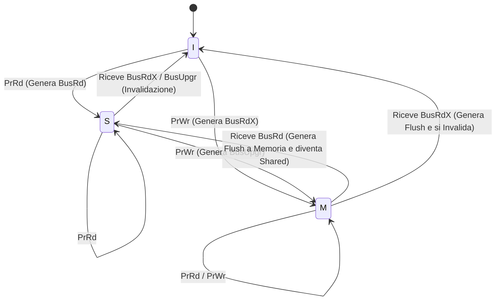

# 📌 Coerenza della Cache in Sistemi Multiprocessore

## 1. Contesto e Motivazione
Nelle architetture Multiprocessore (es. Multicore UMA o NUMA), i processori condividono la memoria centrale ma possiedono cache L1/L2 private. Quando più core leggono e scrivono la medesima variabile $X$ condivisa, le repliche nei rispettivi livelli di cache possono divergere (inconsistenza temporale). Il sistema hardware deve garantire la **Coerenza della Cache**, ossia fornire a ogni processore l'illusione di operare su un'unica memoria omogenea, implementando protocolli a livello di *Cache Controller*.

> **Definizione:** La *Coerenza della Cache* è il meccanismo hardware che garantisce che la lettura di una locazione di memoria restituisca sempre l'ultimo valore scritto in quella locazione da qualsiasi processore nel sistema.

## 2. Nucleo Teorico ed Elaborazione Tecnica
Esistono due approcci di routing dei segnali di coerenza:
- **Bus Snooping (UMA/NUMA):** Ogni controller della cache ascolta ("spia") passivamente il bus di sistema per intercettare transazioni dirette a blocchi di memoria presenti nella propria cache.
- **Directory-Based (NUMA):** Una directory centralizzata o distribuita tiene traccia dello stato di ogni blocco e di quali cache lo posseggano, evitando il broadcast su bus (essenziale per scalare oltre i 64 core).

I protocolli si dividono in due famiglie logiche in caso di scrittura (*Write*):
1. **Invalidazione (Write-Invalidate):** Chi scrive invalida le copie altrui. (Es. MSI, MESI). Minimizza il traffico su scritture sequenziali dello stesso core.
2. **Aggiornamento (Write-Update):** Chi scrive spara il nuovo dato sul bus, aggiornando le cache altrui. (Es. DRAGON). Riduce il Miss-Rate (read miss) ma intasa il bus.

> **Consiglio:** Attenzione al *Falso Sharing* (Falsa Condivisione). Avviene quando due core modificano variabili *diverse* che però risiedono nello *stesso* blocco di cache (cache line). Il protocollo di coerenza invaliderà l'intero blocco avanti e indietro, degradando le prestazioni come se stessero scrivendo sulla stessa variabile.

### 2.1 Esempio di Inconsistenza
Se il Core 1 e il Core 2 caricano la variabile $X=5$ nelle loro cache L1 private:
1. Core 1 esegue $X = X + 2$ (ora $X=7$ nella L1 del Core 1).
2. Core 2 legge $X$ dalla sua L1 e ottiene 5 (dato obsoleto).
Senza coerenza hardware, il programma si comporterebbe in modo scorretto.

### 2.2 Protocollo MESI (Invalidazione)
È lo standard *de facto* dell'industria. Estende il protocollo base MSI introducendo lo stato "Exclusive" per abbattere le comunicazioni su dati privati.
- **M (Modified/Dirty):** Il blocco è presente solo in questa cache ed è stato modificato. Memoria centrale obsoleta.
- **E (Exclusive):** Il blocco è presente solo in questa cache ma non è stato modificato. (Permette la transizione $E \to M$ senza notificare il bus).
- **S (Shared):** Il blocco è condiviso tra più cache, intatto.
- **I (Invalid):** Il dato non è valido.

### 2.3 Protocollo DRAGON (Aggiornamento)
Adotta 4 stati: Exclusive (E), Shared-Clean (SC), Shared-Modified (SM), Modified (M). Quando un core scrive un blocco condiviso, l'operazione di `PrWr` su uno stato `Sc/Sm` genera una transazione `BusUpd` (Update), che costringe gli altri core ad aggiornare il valore locale e la CPU esecutrice a transitare nello stato `Sm` (assumendo il ruolo di "owner" temporaneo senza invalidare gli altri).

## 3. Modello Matematico / Formalizzazione (Diagrammi di Stato)
La coerenza è modellabile come una Macchina a Stati Finiti Mealy/Moore per ogni blocco di cache.
Di seguito il diagramma architetturale per una transizione base del protocollo **MSI** (M=Modified, S=Shared, I=Invalid):

### 3.1 Esercizio Pratico: Tracciamento Stati MESI
**Problema:** Siano dati due Core (C1, C2) con protocollo MESI e una variabile $X$ in memoria centrale (inizialmente non in cache). Tracciare lo stato della cache line contenente $X$ per C1 e C2 dopo la seguente sequenza:
1. C1 legge $X$.
2. C2 legge $X$.
3. C2 scrive su $X$.
4. C1 legge $X$.

**Procedimento:**
- **Inizio:** C1 = I, C2 = I.
- **Azione 1 (C1 legge $X$):** C1 non trova $X$ (Read Miss). Mette $X$ sul bus. Nessuno ce l'ha. La memoria fornisce $X$. C1 carica $X$ in stato **Exclusive (E)**. 
  *Stato: C1=E, C2=I.*
- **Azione 2 (C2 legge $X$):** C2 ha Read Miss. C1 intercetta la richiesta (Snoop), fornisce il dato e passa a Shared. Anche C2 entra in Shared. 
  *Stato: C1=S, C2=S.*
- **Azione 3 (C2 scrive su $X$):** C2 ha una Write Hit in un blocco Shared. Invia un segnale di invalidazione (BusUpgr). C1 riceve il segnale e invalida la sua copia. C2 aggiorna il dato e passa a Modified. 
  *Stato: C1=I, C2=M.*
- **Azione 4 (C1 legge $X$):** C1 ha un Read Miss. C2 (che ha la copia sporca in M) intercetta, esegue un Flush (scrive il dato aggiornato in memoria) e invia il dato a C1. Entrambi tornano in Shared. 
  *Stato: C1=S, C2=S.*

## 4. Riferimenti Incrociati (Zettelkasten)
- **Nota Upstream (Concetto più generale):** [[Architettura Hardware SIMD/MIMD]]
- **Note Downstream (Specifiche/Esempi):** [[NUMA vs UMA]], [[Protocollo MOESI]]
- **Note Correlate (Orizzontali):** [[202607011241_Gerarchia_Memoria]], [[Sincronizzazione Processi (Spinlock)]]
