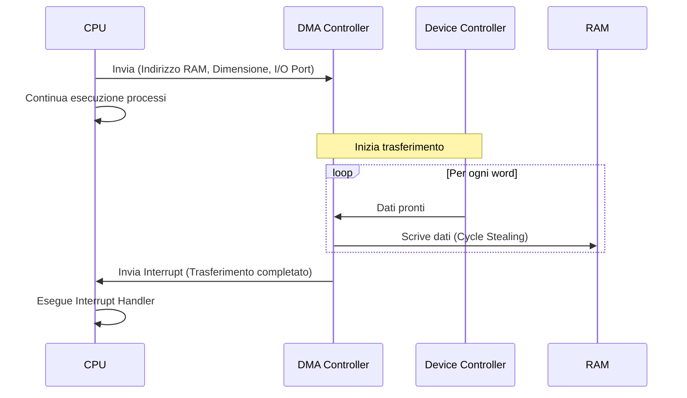

# 📌 Gestione dell'Input/Output (I/O) e Controller

## 1. Contesto e Motivazione
I dispositivi periferici (dischi, tastiere, reti) possiedono caratteristiche elettriche e temporali estremamente eterogenee e risultano infinitamente più lenti della CPU. Per non frenare il processore, le architetture separano l'hardware di I/O dalla CPU introducendo l'astrazione del **Controller (o Interfaccia I/O)**. Il controller maschera l'elettronica del dispositivo, esponendo verso la CPU dei registri standard (Dati, Controllo, Stato).

> **Definizione:** Il *Controller di I/O* è un chip (o un insieme di chip) hardware che funge da intermediario tra il bus di sistema della CPU/Memoria e i cavi del dispositivo periferico, traducendo i comandi logici in segnali elettrici specifici.

## 2. Nucleo Teorico ed Elaborazione Tecnica

### Indirizzamento dell'I/O
La CPU deve poter accedere ai registri dei controller periferici. Due paradigmi:
1. **Isolated I/O:** Esiste uno spazio degli indirizzi separato per l'I/O. Richiede istruzioni assembly dedicate e privilegiate (es. `IN`, `OUT` su architettura x86).
2. **Memory Mapped I/O:** I registri dei dispositivi sono mappati nello spazio degli indirizzi della memoria centrale. La CPU utilizza le normali istruzioni `LOAD` e `STORE`. *Attenzione:* per funzionare, il Memory Controller non deve inoltrare alla RAM gli indirizzi riservati all'I/O.

### Paradigmi di Esecuzione I/O
Come comunica la CPU con i lenti dispositivi fisici?
1. **I/O Programmato (Polling / Busy-Waiting):** La CPU invia un comando al controller e cicla a vuoto (while-loop controllando il bit di `ready` nel registro di stato) fino al completamento. *Estremamente inefficiente*, spreca cicli di clock (Busy Waiting).
2. **I/O guidato da Interrupt:** La CPU innesca l'I/O e prosegue l'esecuzione di altri processi. A lavoro finito, il controller asserisce un segnale hardware (Interrupt/INT) sul bus. La CPU sospende l'attività corrente, salva il contesto (Program Counter) e salta all'**Interrupt Handler** (Routine di Servizio), leggendo il dato dal buffer del controller alla RAM (via software). Per gestire conflitti si usa l'Interrupt Vettorizzato o il Daisy Chaining (identificatori `INTA` o `device_id`).
3. **DMA (Direct Memory Access):** Per dispositivi ad alta banda (SSD, Rete), il trasferimento parola-per-parola gestito dall'Interrupt Handler congestionerebbe la CPU. Si delega il lavoro al Controller DMA. La CPU ordina "leggi il blocco B all'indirizzo RAM R". Il DMA prende possesso del bus (*Cycle Stealing* o *Burst Mode*), pompa i dati direttamente in memoria centrale bypassando la CPU, e innesca un singolo interrupt solo alla fine del trasferimento dell'intero blocco.

> **Consiglio:** Ricorda che nel DMA il "Cycle Stealing" implica che il DMA controller e la CPU competono per l'accesso al Front Side Bus (FSB). Se il DMA ne ha bisogno, l'accesso della CPU viene ritardato di un ciclo (stall). Tuttavia, poiché la cache L1/L2 disaccoppia la CPU dalla RAM, l'impatto prestazionale sulla CPU è minimo finché non sperimenta un cache miss.

### 2.1 Diagramma Sequenza DMA

## 3. Modello Matematico / Formalizzazione
Il vantaggio temporale del DMA sull'Interrupt I/O standard si modella banalmente:
- Se $N$ è la dimensione in byte di un blocco di dati e $B$ è la dimensione del buffer (in byte scambiati ad ogni interrupt, es. 4 byte), l'Interrupt classico invocherà la routine di interrupt $\frac{N}{B}$ volte (causando un altissimo Overhead da Context Switch).
- Il DMA invocherà l'interrupt esattamente **1 volta** per l'intera transazione.

Risparmio di cicli = $\left(\frac{N}{B} - 1\right) \times T_{ContextSwitch}$

### 3.1 Esercizio Pratico
**Problema:** Dobbiamo trasferire un file da 4 KB (4096 byte) da un disco alla RAM. Il controller del disco possiede un buffer di 4 byte (una word da 32 bit). Il tempo di overhead per gestire un singolo interrupt (Context Switch e setup) è di $2 \mu s$. Quanto tempo di CPU viene sprecato (solo in overhead di interrupt) usando la tecnica "Interrupt I/O" classica rispetto al "DMA"?

**Procedimento:**
1. Parametri: $N = 4096$ byte, $B = 4$ byte/interrupt, $T_{ContextSwitch} = 2 \mu s$.
2. **Caso Interrupt I/O:**
   Numero di interrupt = $\frac{N}{B} = \frac{4096}{4} = 1024$ interrupt.
   Overhead totale = $1024 \times 2 \mu s = 2048 \mu s$ (circa 2 millisecondi di tempo rubato alla CPU solo per passare dal SO ai processi e viceversa).
3. **Caso DMA:**
   Il DMA trasferisce tutti i 4096 byte in autonomia e lancia **1** solo interrupt alla fine.
   Overhead totale = $1 \times 2 \mu s = 2 \mu s$.
4. **Risparmio:** Il DMA ha risparmiato $2048 - 2 = 2046 \mu s$ di puro tempo CPU.

## 4. Riferimenti Incrociati (Zettelkasten)
- **Nota Upstream (Concetto più generale):** [[Astrazione Hardware]]
- **Note Downstream (Specifiche/Esempi):** [[Topologie Bus: PCIe, SCSI, USB]], [[Gestione Dispositivi a Caratteri vs Blocchi]]
- **Note Correlate (Orizzontali):** [[202607011244_Protezione_Hardware_OS]]
