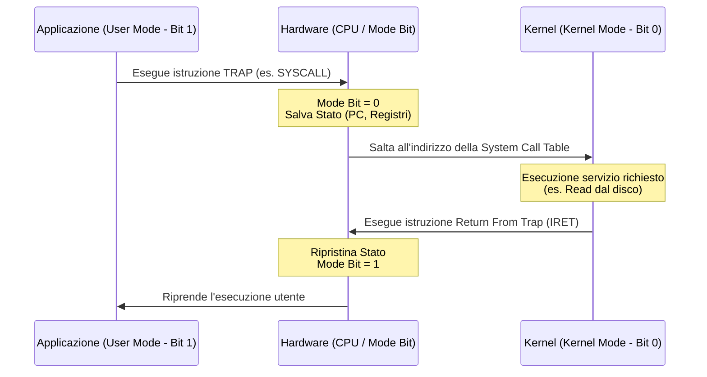

# 📌 Protezioni Hardware e System Call

## 1. Contesto e Motivazione
Affinché un Sistema Operativo multiprogrammato possa funzionare, è necessario proteggere i processi utente tra di loro e difendere il Sistema Operativo stesso dal codice utente (malintenzionato o buggato). Questa segregazione non può essere garantita puramente via software (Sistemi come MS-DOS crashavano per l'assenza di tali protezioni); necessita di un forte supporto hardware microarchitetturale, introdotto tramite il concetto di **Funzionamento in Dual-Mode**.

> **Definizione:** Il *Dual-Mode Operation* è un'architettura hardware che prevede (almeno) due livelli di privilegio d'esecuzione per la CPU: User Mode (limitato) e Kernel Mode (assoluto).

## 2. Nucleo Teorico ed Elaborazione Tecnica

### Dual-Mode (User/Kernel Mode)
L'hardware definisce un **Mode Bit** (es. `0`=Kernel, `1`=User). Le istruzioni macchina vengono classificate in:
- *Non Privilegiate:* Addizioni, jump, logica. Eseguibili liberamente.
- *Privilegiate:* Accesso all'I/O (`IN`/`OUT`), manipolazione del registro MMU (gestione memoria), mascheramento interrupt (`CLI`/`STI`), modifica del timer di sistema o del *Mode Bit*. Tali istruzioni generano un'eccezione hardware (TRAP) se invocate in User Mode, causando la terminazione del processo incriminato.

### Il Concetto di TRAP e le System Call
Una **Trap** è un'interruzione *software*, sincrona e prevedibile, generata dal programma in esecuzione. Viene utilizzata per:
1. Intercettare errori irrecuperabili (Divide by zero, Segfault).
2. Fornire il meccanismo delle **System Call**. 

Poiché i processi User Mode non possono manipolare l'I/O, richiedono l'intervento del SO. Il processo popola i registri con i parametri della richiesta e invoca l'istruzione speciale.
- **Esempio:** `INT 0x80` o `SYSCALL` in Linux.
L'hardware eleva atomicamente i privilegi (setta il Mode Bit a 0) e salta in modo sicuro alla tabella vettoriale del Kernel, eseguendo le funzioni del SO ad alto privilegio. Alla fine, una istruzione di "return from trap" ripristina lo stato utente.

### Le 3 Protezioni Fondamentali
1. **Protezione dell'I/O:** Tutte le istruzioni di input/output sono privilegiate. Nessun programma può aggirare il filesystem leggendo direttamente i settori del disco.
2. **Protezione della Memoria:** Isolamento degli spazi di indirizzamento. Architetture semplici sfruttano un paio di registri hardware privilegiati: **Registro Base** (inizio memoria fisica consentita) e **Registro Limite** (dimensione del blocco). Ad ogni accesso, l'MMU hardware controlla: `Indirizzo >= Base` e `Indirizzo < (Base+Limite)`. In caso contrario, genera Trap (Memory Fault). Nei sistemi moderni si usano le Tabelle delle Pagine (Page Tables).
3. **Protezione della CPU (Preemption):** Un processo bloccato in un loop infinito (`while(true)`) monopolizzerebbe la CPU. Si inserisce un orologio hardware programmabile (Timer) inizializzato ad ogni context switch. Il timer de-crementa costantemente. Allo scadere lancia un Interrupt non ignorabile, che strappa coercitivamente l'esecuzione al processo e restituisce il controllo allo Scheduler del SO (Time Sharing). Modificare il timer è un'istruzione privilegiata.

> **Consiglio:** Le Trap sono *sincrone* (generate dall'istruzione in esecuzione), mentre gli Interrupt sono *asincroni* (generati dall'hardware esterno, in qualsiasi momento).

### 2.1 Diagramma di Transizione Dual-Mode

## 3. Modello Matematico / Formalizzazione
I passaggi di parametri tra Spazio Utente e Spazio Kernel durante le System Call avvengono tramite tre strategie computazionali formali:
1. **Per Registro:** I parametri ($P_1, P_2, \ldots, P_k$) sono collocati nei registri generali prima della TRAP. Latenza minima (Costo $\approx O(k)$ cicli di registro), ma non scala se $k$ supera la capienza architetturale.
2. **Per Tabella in Memoria:** I parametri sono serializzati in una struct in User Space, e l'indirizzo $A_{struct}$ è passato in un registro. Il Kernel leggerà via Memory Mapping. (Costo = Dereferenziazione Punter).
3. **Per Stack (Push/Pop):** Parametri subiscono `PUSH` sullo User Stack, il Kernel li leggerà eseguendo un pop semantico o offset pointer (`EBP` based).

### 3.1 Esercizio Pratico
**Problema:** Un programma deve effettuare una System Call passando 7 argomenti (ognuno di 32 bit). La CPU possiede solo 5 registri generali utilizzabili per il passaggio di parametri. Spiegare quale strategia di passaggio parametri verrà adottata e calcolare la quantità di byte che il Kernel dovrà andare a leggere in memoria (User Space) qualora non usasse i registri.

**Procedimento:**
1. Poiché il numero di argomenti (7) è maggiore del numero di registri disponibili (5), la strategia "Per Registro" *non* può essere usata per tutti i parametri simultaneamente.
2. Il sistema ricorrerà alla strategia "Per Tabella in Memoria" o "Per Stack".
3. In entrambi i casi, gli argomenti vengono salvati in memoria RAM (User Space).
4. Ogni argomento è a 32 bit (4 byte).
5. Il totale dei dati da leggere in memoria è $7 \times 4 = 28$ byte.
6. Il processo scriverà questi 28 byte in una struct/stack in User Space, inserirà un puntatore a quest'area di memoria in uno dei registri disponibili, ed eseguirà la TRAP. Il kernel dereferenzierà il puntatore leggendo i 28 byte.

## 4. Riferimenti Incrociati (Zettelkasten)
- **Nota Upstream (Concetto più generale):** [[202607011231_Fondamenti_Sistemi_Operativi]]
- **Note Downstream (Specifiche/Esempi):** [[POSIX API]], [[Memory Management Unit (MMU)]], [[Scheduling Algoritms]]
- **Note Correlate (Orizzontali):** [[Gestione Interrupt vs Trap]], [[202607011243_Gestione_Input_Output]]
