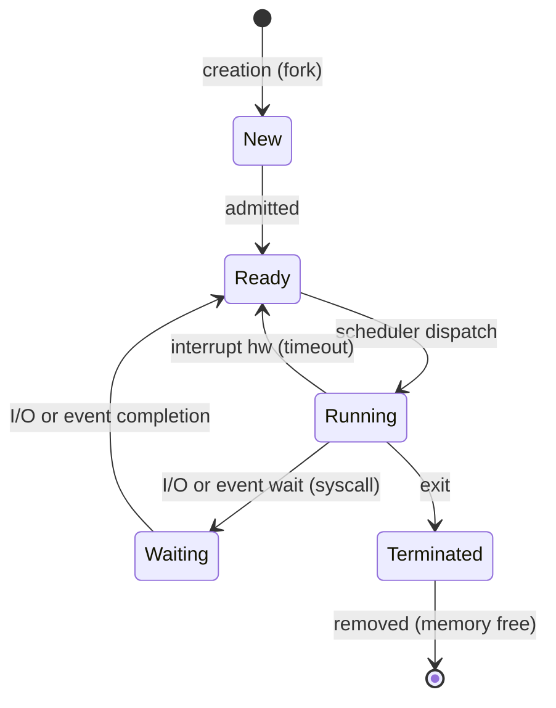

# 📌 Gestione dei Processi e Thread

## 1. Il Concetto di Processo
Un programma è un'entità passiva memorizzata su disco, mentre un **processo** è l'entità attiva, ovvero il programma in esecuzione. 

Formalmente, un processo $P$ è definito come $P = (C, S)$, dove:
- **$C$ (Codice):** il codice eseguibile (Text section).
- **$S$ (Stato dell'esecuzione):** l'insieme di elementi che caratterizzano il contesto al momento, tra cui il *Program Counter (PC)*, i registri della CPU, lo *stack* (per le variabili locali e gli indirizzi di ritorno), l'*heap* (per la memoria allocata dinamicamente come `malloc`), e la *data section* (variabili globali/statiche).

### 1.1 Diagramma di Stato di un Processo
Durante la sua vita, un processo transita tra vari stati logici:



## 2. Process Control Block (PCB) e Context Switch
Tutte le informazioni relative ad un processo sono mantenute dal Kernel all'interno di una struttura dati denominata **PCB (Process Control Block)** o Descrittore di Processo. Contiene: stato, program counter, registri, info di scheduling, gestione memoria, e lista dei file aperti.

Il **Context Switch** è l'operazione tramite la quale il Sistema Operativo sospende l'esecuzione di un processo $P_0$, salva il suo stato nel $PCB_0$, e ripristina lo stato di un processo $P_1$ dal suo $PCB_1$. 
> [!WARNING]
> Il context switch costituisce puro *overhead* (spreco di CPU), in quanto il sistema in quegli istanti non esegue lavoro utile. Il tempo richiesto dipende fortemente dal supporto hardware.

## 3. Creazione e Terminazione
- **Creazione:** I processi sono creati strutturandosi ad albero. Nei sistemi UNIX, la system call `fork()` crea un clone esatto del padre. Successivamente, la `exec()` può sovrascrivere lo spazio di memoria del figlio con un nuovo programma.
- **Terminazione:** Un processo termina volontariamente con `exit()` (il padre può attendere e leggere lo stato con `wait()`). Il padre può forzare la terminazione del figlio tramite `abort()` (spesso portando alla terminazione a cascata).

## 4. I Thread
Un **Thread** (filo di esecuzione) è l'unità base di utilizzo della CPU. I processi multithread possiedono più thread che condividono lo stesso spazio di indirizzamento (codice, dati, file aperti), ma **ciascun thread mantiene il proprio Stack, Program Counter e Registri**.

> [!CAUTION]
> Poiché lo spazio di memoria è condiviso, **non vi è protezione fra thread**: un thread può accedere e "pasticciare" con i dati degli altri thread dello stesso processo!

### 4.1 Modelli di Multithreading
- **Thread a livello utente (User Thread):** gestiti da librerie user-space (es. vecchie JVM). Il kernel vede un solo processo. Se un thread fa una I/O bloccante, blocca tutti i thread. (Modello *Molti-a-Uno*).
- **Thread a livello Kernel (Kernel Thread):** supportati e schedulati nativamente dal SO (es. Windows, Linux). Se un thread si blocca, gli altri procedono. (Modello *Uno-a-Uno*).

## 5. Implementazione in Linux (I Task)
Linux non distingue rigidamente tra processi e thread; entrambi sono descritti internamente da una singola struttura chiamata **Task** (tramite la `task_struct`).
- **`fork()`**: crea un task copiando per intero lo spazio di indirizzi (Processo).
- **`clone()`**: crea un task condividendo parzialmente lo stato col genitore, a seconda dei flag (es. `CLONE_VM` per condividere la memoria virtuale, `CLONE_FILES` per i file aperti, creando così un Thread).

Un task Linux è definito da:
1. **Identità:** PID, Credentials (User/Group ID), Personality, Namespace.
2. **Ambiente:** Vettore degli argomenti (es. `argv` in C) e vettore d'ambiente (`NAME=VALUE`).
3. **Contesto:** Scheduling context, informazioni contabili, tabella file aperti (file descriptors), signal-handler table, e virtual-memory context.

## 6. Esercizio di Esempio (Pratica C / Java)

### Esercizio 1: Uso della Fork in C
**Problema:** Cosa stampa il seguente frammento di codice C?
```c
#include <stdio.h>
#include <unistd.h>

int main() {
    int value = 5;
    pid_t pid = fork();
    
    if (pid == 0) { // Figlio
        value += 15;
        printf("Figlio: value = %d\n", value);
    } else if (pid > 0) { // Padre
        wait(NULL);
        printf("Padre: value = %d\n", value);
    }
    return 0;
}
```
**Soluzione:** La `fork()` crea un processo figlio con uno spazio degli indirizzi **duplicato** ma indipendente. Le modifiche alla variabile `value` nel figlio non si riflettono sul padre. Pertanto l'output sarà:
`Figlio: value = 20`
`Padre: value = 5`

### Esercizio 2: Thread in Java (Condivisione memoria)
In Java, creando thread usando l'interfaccia `Runnable`, essi condividono lo stesso oggetto. Senza sincronizzazione, ci si espone a *Race Conditions*.
```java
// Thread t e u condividono l'oggetto 'Counter c'
Thread t = new Thread(c);
Thread u = new Thread(c);
t.start(); u.start();
t.join(); u.join(); // Il padre (main) aspetta la loro terminazione
```
Se `t` incrementa una volta e `u` incrementa due volte concorrentemente il contatore `c`, il risultato finale è non deterministico a causa della mancanza di mutua esclusione!
